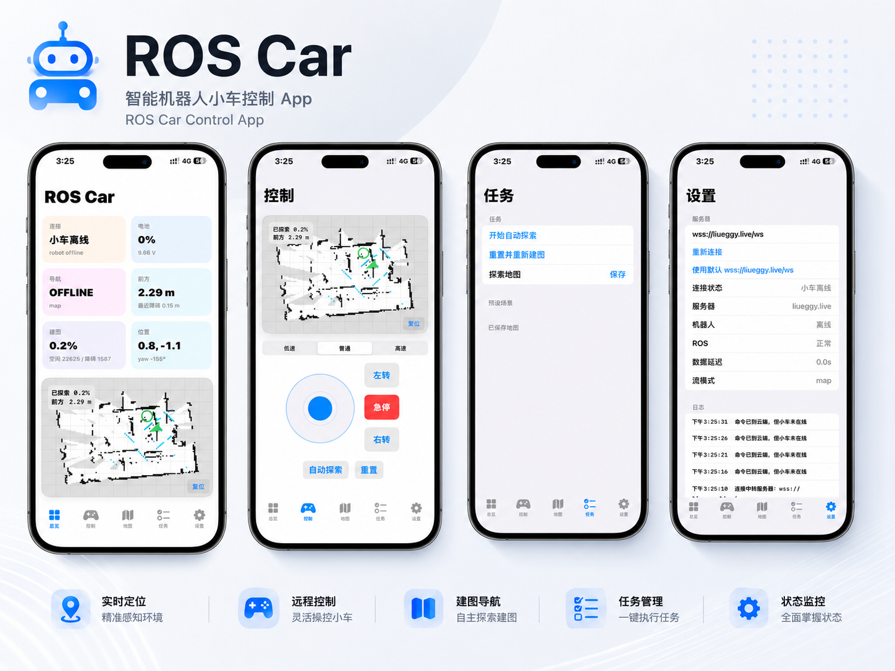
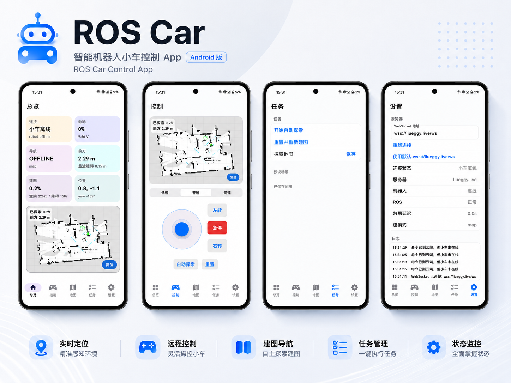

# Ros_car_app

Eggy ROS 小车的原生移动端。这个仓库只放手机 App：Android 和 iOS。云端中转服务、网页控制台在另一个仓库。

- 后端仓库：<https://github.com/liueggy/Ros_car_web>
- 默认连接：`wss://liueggy.live/ws`
- 最新安装包：GitHub Release `mobile-latest`

## 界面预览

### iOS 版



### Android 版



## 现在能做什么

App 通过 WebSocket 连接云端 relay，再由 relay 转到小车上的 ROS agent。手机不直接连 ROS Master。

主要功能：

- 查看小车在线状态、ROS 数据新鲜度、电池、导航状态
- 显示地图、雷达点、路径、小车姿态和目标点
- 手动控制：前进、后退、左右平移、旋转、急停
- 建图相关：自动探索、重置地图、保存/加载地图
- 常用任务入口和连接参数设置
- 断线自动重连，发送控制指令前会检查连接状态

## 目录

```text
android/EggyRosCar/        Android 原生客户端
ios/EggyRobotClient/       iOS SwiftUI 客户端
docs/                      维护说明
.github/workflows/         iOS 自动构建
```

## Android

本地构建：

```bash
cd android/EggyRosCar
gradle assembleDebug
```

构建产物：

```text
android/EggyRosCar/app/build/outputs/apk/debug/*.apk
```

**注意：** Android 不再使用 GitHub Actions 自动构建。请在本地编译完成后，手动上传 APK 到 Release `mobile-latest`：

```text
EggyRosCar-debug.apk
```

## iOS

本地打开工程：

```bash
cd ios/EggyRobotClient
brew install xcodegen
xcodegen generate
open EggyRobotClient.xcodeproj
```

Actions 默认构建的是未签名 IPA：

```text
ROS-Car-unsigned.ipa
```

未签名 IPA 不能直接安装，需要用轻松签、Sideloadly、AltStore、iOS App Signer，或者自己的开发者证书重新签名。

如果以后要在 Actions 里出签名包，需要配置这些 Secrets：

```text
IOS_CERTIFICATE_P12
IOS_CERTIFICATE_PASSWORD
IOS_PROVISIONING_PROFILE
```

## Release 规则

Android 和 iOS 共用一个滚动 Release：

```text
tag: mobile-latest
name: Eggy ROS Car Mobile Latest
```

里面保留两个文件：

```text
EggyRosCar-debug.apk
ROS-Car-unsigned.ipa
```

